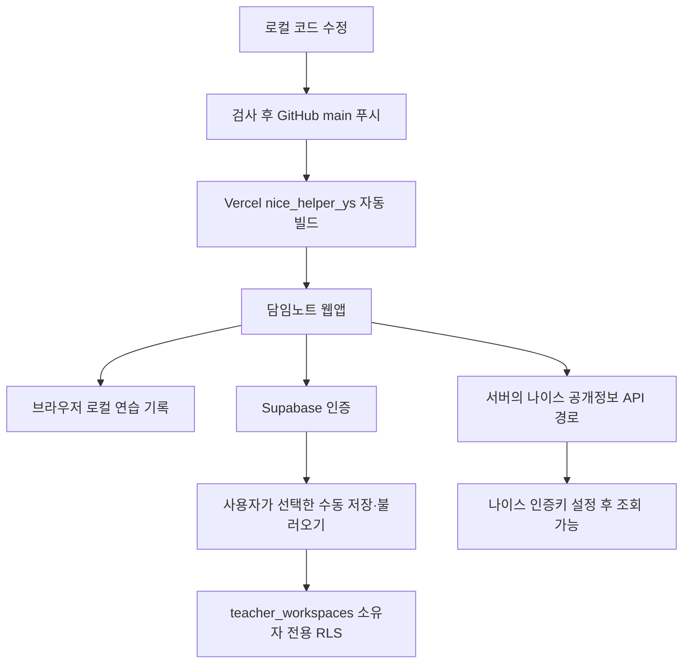

# 배포와 이후 수정

2026-09-29 기준으로 가상 데이터 시제품을 기존 GitHub·Vercel·Supabase 프로젝트에 연결했습니다. [배포된 앱](https://nicehelperys.vercel.app)에서 기본 화면을 사용할 수 있습니다. Google GIS 구현의 커밋 `d4bd638` 배포가 Ready이며 운영 앱의 공식 한국어 로그인 버튼과 공개 정책 페이지를 확인했습니다. Google 앱도 Production으로 전환했습니다. Google·이메일의 실제 로그인과 로그인 후 클라우드 저장·불러오기는 아직 검증하지 않았습니다.

## 연결 대상

| 역할 | 현재 대상 |
| --- | --- |
| Git 저장소 | [gmlduqzhd-eng/Nice](https://github.com/gmlduqzhd-eng/Nice), 공개 저장소 |
| 배포 브랜치 | `main` |
| Vercel 대상 | 기존 프로젝트 `nice_helper_ys` |
| 앱 주소 | [nicehelperys.vercel.app](https://nicehelperys.vercel.app) |
| Supabase 대상 | 기존 `Nice` 프로젝트, 서울 리전 |
| Supabase 공개 프로젝트 주소 | `https://zskqtnweoiskgbdnraue.supabase.co` |
| 초기 연결 검증 커밋 | `bc8a568` |

같은 GitHub 저장소에는 다른 Vercel 프로젝트 `nice_helper`도 이미 연결되어 있어 자동 빌드가 실행됩니다. 이번 작업에서 새로 구성한 연결이 아니며 삭제하거나 설정을 변경하지 않았습니다. 이후 작업은 `nice_helper_ys`와 위 앱 주소를 기준으로 확인합니다. 한 번의 푸시가 연결된 두 프로젝트의 빌드를 실행할 수 있습니다.

이번 연결에서는 브라우저의 GitHub 계정 `gmlduqzhd-eng`을 사용했습니다. 연결 도구가 반환하는 계정·프로젝트 목록이 브라우저와 다를 수 있으므로 이후 자동화 전에 저장소 소유자, Vercel 프로젝트 이름과 앱 주소, Supabase 프로젝트를 다시 대조합니다. 다른 계정의 동명 프로젝트를 수정하지 않습니다.

## 데이터와 배포 흐름



GitHub는 코드를 보관하고 Vercel이 웹앱을 배포합니다. Supabase는 로그인과 계정별 스냅샷 보관을 담당합니다. 로그인만으로 브라우저 기록을 업로드하지 않습니다. 나이스 내부 학생부에 자동 입력하는 연결은 없습니다.

## 현재 배포 설정

- 프레임워크: Next.js 16.3.6
- Node.js: `package.json`의 `24.x`
- 패키지 관리자: `packageManager`에 고정한 pnpm 11.19.0
- Vercel 함수 리전: `vercel.json`의 `icn1`
- All Environments에 `ENABLE_EXPERIMENTAL_COREPACK=1`, `NEXT_PUBLIC_SUPABASE_URL`, `NEXT_PUBLIC_SUPABASE_PUBLISHABLE_KEY` 설정
- Install Command는 기본 자동 설정 유지

빌드 로그에서 Corepack과 고정된 pnpm·Next.js 버전을 확인했습니다. 개발 도구 `agent-browser`의 Chrome 미설치 경고가 있었지만 앱 빌드와 배포는 성공했습니다. 서버에서 브라우저 검증을 추가할 때는 별도의 Chrome 환경이 필요합니다.

공개 환경변수는 빌드 때 브라우저 번들에 들어가므로 값 변경 후 다시 배포합니다. `service_role`·비밀 키를 `NEXT_PUBLIC_` 변수에 넣지 않습니다. 실제 키, `.env.local`, `.vercel/`은 Git에 넣지 않습니다. 나이스 `NEIS_API_KEY`는 아직 설정하지 않았습니다.

Google 로그인은 GIS 공식 버튼의 ID token을 Supabase에 전달하도록 구현했습니다. Supabase에 공개 Client ID를 등록하고 Secret은 빈값으로 저장했으며, 공개 Auth 설정에서 Google 활성화를 확인했습니다. 운영 앱 origin도 Google 웹 클라이언트에 등록했습니다. 운영 환경의 공개 Client ID와 `NEXT_PUBLIC_GOOGLE_AUTH_ENABLED=true`를 반영한 커밋 `d4bd638` 배포가 `nice_helper_ys`에서 Ready인 것을 확인했고, 앱에서 공식 한국어 버튼을 확인했습니다. `/privacy`와 `/terms`도 무인증 HTTP 200 및 제목을 확인했습니다. Google Audience는 **Production 전환 완료** 상태입니다. 인증 센터는 기본 인증 범위에 데이터 접근 심사가 필요 없다고 안내하며, 별도 브랜드 검증은 진행하지 않았습니다. Codex 내장 브라우저에서 Google 버튼 클릭 후 FedCM 토큰 수신 오류가 관측됐으나 원인은 확정하지 않았습니다. **일반 브라우저의 실제 계정 인증·원격 백업 검증은 남아 있습니다.** 이전 Chrome 연결 중단 이력과 현재 관측은 [Google 로그인 안내](GOOGLE_AUTH.md)에 구분해 기록했습니다.

GIS 앱에는 공개 `NEXT_PUBLIC_GOOGLE_CLIENT_ID`와 표시 플래그 `NEXT_PUBLIC_GOOGLE_AUTH_ENABLED`를 환경별로 설정합니다. Client ID는 공개 앱 식별자이며 Client Secret은 이 흐름에 필요하지 않습니다. 예제 플래그는 기본 `false`이고 대상 빌드에서 `true`로 바꿉니다. 미리보기의 정확한 origin도 Google Authorized JavaScript origins에 등록해야 합니다. 환경변수 저장 후 다시 배포하고, 모의 검증과 실제 계정 선택·인증·수동 백업 검증 결과를 구분해 기록합니다. [Google 설정과 확인 절차](GOOGLE_AUTH.md)

로컬에는 Supabase 공개 설정을 담은 `.env.local`과 Vercel 연결 메타데이터 `.vercel/project.json`을 작성했으며 둘 다 Git에서 제외됩니다. 커밋 작성자 설정은 이 저장소 범위에만 저장했으며 전역 Git 설정은 변경하지 않았습니다. 새 컴퓨터에서 저장소를 복제하면 이 로컬 설정을 별도로 준비해야 합니다.

Supabase Site URL은 `https://nicehelperys.vercel.app`입니다. 반환 주소는 해당 앱 주소, `http://localhost:3000`, `http://127.0.0.1:3000` 각각 마지막 `/` 유무를 포함해 총 6개를 등록하고 저장 결과를 확인했습니다. 새 미리보기 주소에서 이메일 로그인을 시험하려면 신뢰하는 해당 주소를 별도로 등록합니다.

## 코드를 수정하고 반영하기

1. `AGENTS.md`와 제품 기준을 읽고 현재 작업 트리 변경 내용을 확인합니다.
2. 기능을 수정하고 아래 검사를 수행합니다. 화면 흐름을 바꾸면 개발 서버에서 관련 `pnpm test:e2e`도 실행합니다.
3. 변경 파일과 비밀정보 포함 여부를 확인하고 필요한 파일만 커밋합니다.
4. `main`에 푸시하면 연결된 Vercel 프로젝트의 자동 배포가 시작됩니다.
5. `nice_helper_ys`의 배포가 Ready인지, 대상 커밋이 맞는지 확인하고 앱에서 수정한 흐름을 점검합니다.

```sh
pnpm typecheck
pnpm test
pnpm build
git status --short
git diff --check
git diff
git add -p
git commit -m "변경 내용을 설명하는 메시지"
git push origin main
```

새 파일은 `git add -p`에 포함되지 않으므로 내용을 확인한 뒤 해당 경로를 별도로 `git add`합니다. 검토용 기능 브랜치를 쓰는 경우에는 그 브랜치를 푸시해 미리보기를 확인하고 `main`에 반영합니다. 위 명령은 작업 절차이며 문서 작성만으로 실행되지는 않습니다.

## 데이터베이스 변경과 남은 검증

`supabase/schema.sql`은 2026-09-29 대시보드 SQL Editor에서 적용한 스키마 정의입니다. Supabase CLI 마이그레이션 이력은 만들지 않았습니다. 웹앱 푸시·배포는 이 SQL을 자동 실행하지 않으며, 현재 DB에 그대로 다시 실행하지 않습니다. 다음 DB 변경은 실제 스키마와 차이를 확인한 뒤 별도 변경 파일과 적용·접근 검증 기록으로 관리합니다.

소유자 CRUD, 다른 사용자 접근 차단, 익명 권한, 데이터 제약조건을 SQL 트랜잭션으로 검증했고 테스트 데이터는 롤백했습니다. 실제 익명 REST 요청도 거부되었습니다. 재현용 SQL은 [`supabase/tests/rls-verification.sql`](../supabase/tests/rls-verification.sql)에 있으며 실행 전 적용 대상과 트랜잭션 롤백을 확인합니다. Google 또는 이메일의 실제 로그인 → 가상 기록 수동 저장 → 로그아웃·재로그인 → 불러오기와 두 실제 로그인 세션의 접근 격리는 남아 있습니다. 기본 SMTP의 팀원 대상 전송 제한은 GIS 연결과 별개로 유지됩니다. 자세한 결과는 [검증 기록](VERIFICATION.md), 연결 절차는 [연동 안내](INTEGRATIONS.md)와 [Google 로그인 안내](GOOGLE_AUTH.md)를 참고하세요.
