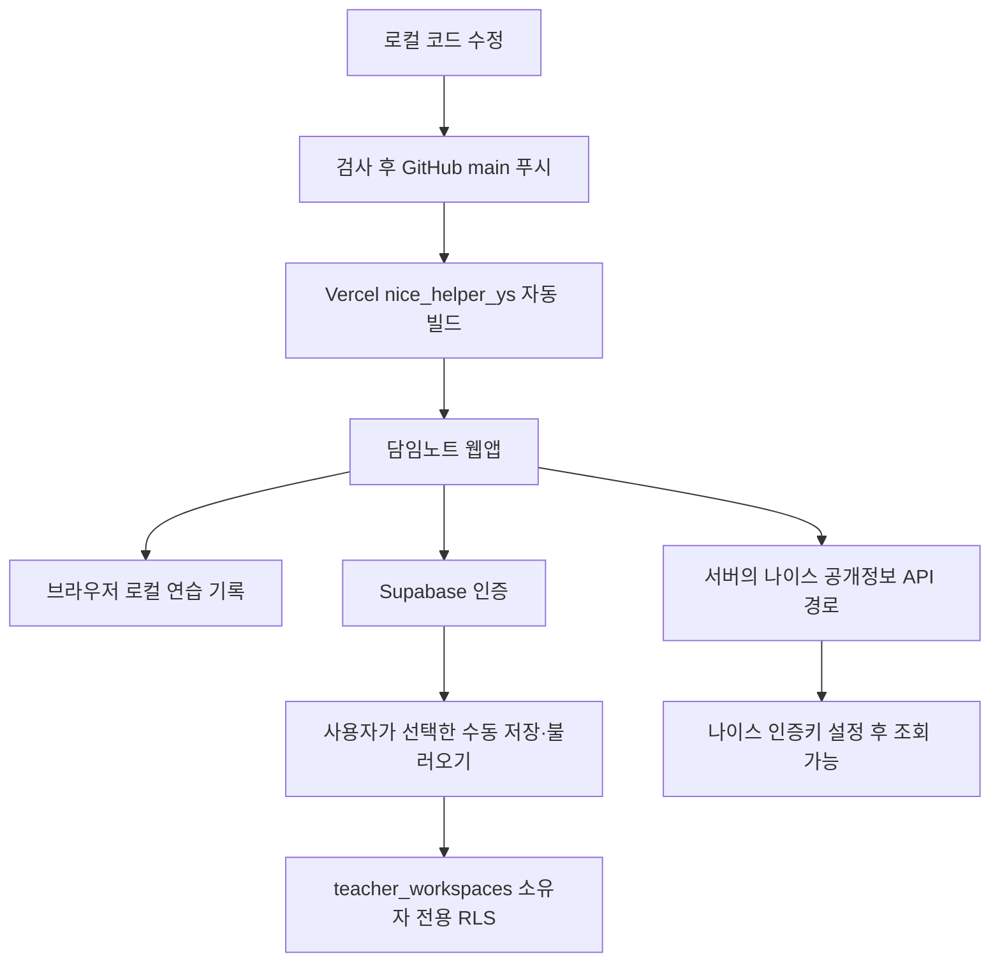

# 배포와 이후 수정

## 학기말 종합의견 연결 준비 (2026-10-01)

현재 `codex/ai-keyword-drafts`의 초안 PR #5에서 키워드 AI와 함께 학기말 작업 준비를 검토한다. 학기말 문장은 별도 학급·교과의 임시 수동 작성 상태이며 기존 행특 문장·검토 상태·백업을 공유하지 않는다. `version: 2`, `task: semester-subject-opinion` 파일에 교과를 포함한다. 기존 행특 v1 파일은 유지한다.

확장은 개인정보 없는 구조 점검과 한국어 점검 사유를 제공하며, 학기말 표의 정확한 열·선택 행·같은 학생 셀·교과를 대조한다. 마감 안내가 보이는 화면은 대조만 진행하고 입력 준비를 만들지 않는다. 입력 직전의 마감·기존 문장 보호는 유지한다. 설치 폴더 갱신 후 확장 다시 로드와 열려 있던 도우미 재실행이 필요하며 웹앱 배포만으로 설치된 확장이 갱신되지는 않는다.

단위/API 67개와 관련 브라우저 27개, 타입 검사·빌드는 가상 자료로 통과했다. 실제 나이스 입력·자동 저장·저장 호환성과 운영 반영은 별도 확인 대상이다. 이번 학기말 기능은 DB 스키마·RLS·인증·환경변수 변경을 요구하지 않는다. 검증의 출처와 한계는 [검증 기록](VERIFICATION.md)을 따른다.

## v0.5 AI 초안 구성 (2026-09-30)

키워드 AI 초안은 서버의 `/api/ai/draft`에서 Google Gemini API를 직접 사용한다. AI SDK `7.0.118`과 Google 공급자 `4.0.82`를 고정했다. `GOOGLE_GENERATIVE_AI_API_KEY`는 서버 전용이며 기존 Google 로그인 Client ID와 별개다. 무료 사용은 Google AI Studio의 Free Tier 프로젝트로 설정한다. Vercel AI Gateway 결제 연결과 유료 모델 자동 전환은 사용하지 않는다.

DB 스키마·RLS·기존 인증 설정은 바꾸지 않는다. 키를 추가한 뒤 재배포하고 실제 가상 키워드 요청을 확인한다. 키가 없으면 UI와 기존 기능은 열리지만 AI 요청은 연결 준비 안내로 끝난다. 모의 테스트나 빌드 성공만으로 실제 AI 연결 완료를 주장하지 않는다. [설정·무료 이용 조건](AI_SETUP.md)

## v0.4.2 배포 구성 (2026-09-30)

재방문 시 반복되는 로그인 안내를 수정하고 성공 안내를 4.5초 후 닫는다. 수동 백업은 기존 `teacher_workspaces`의 `updated_at`을 조건으로 저장해 조회 이후의 다른 기기 변경을 보호한다. 백업·파일 읽기 도중 생긴 현재 기록 변경을 확인한 뒤 복원하며, 복원 전후에 학급·자료 수를 보여 준다.

DB 스키마·RLS·환경변수·인증 공급자 설정 변경은 필요하지 않다. 웹앱을 새로고침하면 적용되며 이미 열어 둔 다른 기기도 새로고침해야 새 저장 보호를 사용한다. 확장은 버전 표시만 0.4.2로 맞추며 권한·입력 동작은 그대로다. 검증한 범위와 실제 계정 확인의 한계는 [검증 기록](VERIFICATION.md)에 구분한다.

## 최신 인증·백업 확인 (2026-09-29 22:33 KST)

운영 앱 `nicehelperys.vercel.app`의 실제 Google 로그인과 가상 자료 수동 저장·같은 Chrome 브라우저 복원을 확인했다. 별도 배포·인증 설정·DB 스키마 변경은 없었다. 다른 브라우저의 불러오기 성공 안내는 사용자가 확인했다. 복원 원문 직접 대조, 다른 PC 확인, 로그아웃 후 재로그인, 실제 두 계정의 접근 격리와 이메일 인증은 아직 미검증이다. 아래 버전별 배포 이력의 미검증 표시는 당시 상태이며 현재 범위는 [검증 기록](VERIFICATION.md)을 기준으로 한다.

## v0.4.1 지정 오류 개선 구성

선택값·기대값 표시, 가상 연습 화면 항목 자동 지정, 웹 연습 도우미 실행 버튼을 추가한다. 패키징은 ZIP 외에도 동일한 `core.js`/`content.js`를 `public/neis-helper/`에 복사한다. 두 산출물은 빌드 시 생성하며 Git에서는 제외한다. 운영 경로 `/neis-practice`에서만 웹 실행과 자동 지정을 제공한다. DB·인증·환경변수 변경은 없다.

웹 배포는 기존에 로드한 확장프로그램을 자동 업데이트하지 않는다. 확장 0.4.1은 기존 설치 폴더 갱신과 확장 관리 화면의 새로고침이 필요하다. 웹 연습은 페이지 새로고침으로 새 코드를 사용한다. 웹 연습 성공과 실제 나이스 호환성 검증은 구분한다.

## v0.4 입력 도우미 배포 구성

`codex/neis-input-assistant`에서 검토된 문장 작업 파일, 입력 도우미 확장프로그램과 가상 연습 화면을 추가했다. 운영 반영 여부는 해당 커밋의 배포 상태와 실제 화면으로 확인한다.

`pnpm dev`와 `pnpm build`는 먼저 `scripts/package-neis-helper.mjs`를 실행해 `public/downloads/damim-neis-helper.zip`을 만든다. 압축에는 `extension/neis-helper/`의 명시된 다섯 파일만 들어가며 환경변수·작업 파일·학생 자료는 들어가지 않는다. 생성 ZIP은 Git에서 제외하고 빌드마다 재생성한다. 앱과 확장 버전이 다르면 패키징을 중단한다. 의존성·DB·운영 환경변수 추가는 없다.

웹앱 배포가 확장프로그램의 브라우저 설치를 대신하지 않는다. Chrome·Edge의 개발자 모드에서 압축 해제 폴더를 직접 로드한다. 스토어 등록은 하지 않았다. `/neis-practice`에서 가상 작업을 확인하며, 실제 나이스 호환성·저장 결과는 별도 검증한다. `activeTab`·`scripting`만 사용하고 인증서·비밀번호 접근이나 비공개 API 호출은 구현하지 않는다. 기존 `NEIS_API_KEY` 미설정은 공개정보 조회 기능에만 해당하며 입력 도우미와 별개이다.

## v0.3 운영 배포 (2026-09-29)

[PR #1](https://github.com/gmlduqzhd-eng/Nice/pull/1)을 `main`에 병합한 커밋 `dc56c898aaaec7c037eae5297215e1f8e846c9f4`의 운영 배포가 성공했다. GitHub의 `Production – nice_helper_ys` 배포 상태와 [Vercel 배포](https://vercel.com/gmlduqzhd-engs-projects/nice_helper_ys/12uyjLVKAsVoi6uE1Kzd9GLfdXmy)의 성공 상태를 대조했다. 실제 [운영 주소](https://nicehelperys.vercel.app)에서 `v0.3` 표시, 학급·명부 메뉴, 가상 학생 추가 후 새로고침 유지, 390px 화면의 가로 넘침 없음과 브라우저 오류 없음까지 확인했다. `/`, `/privacy`, `/terms`는 HTTP 200이었다.

학급·명부 관리와 계정별 로컬 기록 공간이 이번 버전에 포함된다. v2 백업 형식은 v0.3 이상에서만 읽는다. 기존 v1 백업/로컬 원본은 보존하며 새 버전에서 변환해 읽는다. DB 스키마나 인증 공급자 설정은 변경하지 않았다. 실제 Google·이메일 로그인과 원격 백업은 여전히 미검증이며, 나이스 API는 인증키 미설정에 따른 `503 / NEIS_NOT_CONFIGURED` 응답을 확인했다.

로컬 인증 브라우저 테스트에는 합성 Supabase URL·publishable key와 Google Client ID를 프로세스 환경변수로만 사용했다. 테스트 환경변수를 Vercel이나 `.env.local`로 복사하지 않는다. 가상 사용자·모의 API로 검증한 결과를 실제 Google 인증이나 원격 저장 성공으로 해석하지 않는다.

## 이전 연결·배포 이력

2026-09-29에 가상 데이터 시제품을 기존 GitHub·Vercel·Supabase 프로젝트에 연결했습니다. Google GIS 구현의 커밋 `d4bd638` 배포가 Ready였으며 운영 앱의 공식 한국어 로그인 버튼과 공개 정책 페이지를 확인했습니다. Google 앱도 Production으로 전환했습니다. Google·이메일의 실제 로그인과 로그인 후 클라우드 저장·불러오기는 아직 검증하지 않았습니다.

## 연결 대상

| 역할 | 현재 대상 |
| --- | --- |
| Git 저장소 | [gmlduqzhd-eng/Nice](https://github.com/gmlduqzhd-eng/Nice), 공개 저장소 |
| 배포 브랜치 | `main` |
| Vercel 대상 | 기존 프로젝트 `nice_helper_ys` |
| 앱 주소 | [nicehelperys.vercel.app](https://nicehelperys.vercel.app) |
| Supabase 대상 | 기존 `Nice` 프로젝트, 서울 리전 |
| Supabase 공개 프로젝트 주소 | `https://zskqtnweoiskgbdnraue.supabase.co` |
| 초기 연결 검증 커밋 | `bc8a568` |

같은 GitHub 저장소에는 다른 Vercel 프로젝트 `nice_helper`도 이미 연결되어 있어 자동 빌드가 실행됩니다. 이번 작업에서 새로 구성한 연결이 아니며 삭제하거나 설정을 변경하지 않았습니다. 이후 작업은 `nice_helper_ys`와 위 앱 주소를 기준으로 확인합니다. 한 번의 푸시가 연결된 두 프로젝트의 빌드를 실행할 수 있습니다.

이번 연결에서는 브라우저의 GitHub 계정 `gmlduqzhd-eng`을 사용했습니다. 연결 도구가 반환하는 계정·프로젝트 목록이 브라우저와 다를 수 있으므로 이후 자동화 전에 저장소 소유자, Vercel 프로젝트 이름과 앱 주소, Supabase 프로젝트를 다시 대조합니다. 다른 계정의 동명 프로젝트를 수정하지 않습니다.

## 데이터와 배포 흐름



GitHub는 코드를 보관하고 Vercel이 웹앱을 배포합니다. Supabase는 로그인과 계정별 스냅샷 보관을 담당합니다. 로그인만으로 브라우저 기록을 업로드하지 않습니다. 나이스 내부 학생부에 자동 입력하는 연결은 없습니다.

## 현재 배포 설정

- 프레임워크: Next.js 16.3.6
- Node.js: `package.json`의 `24.x`
- 패키지 관리자: `packageManager`에 고정한 pnpm 11.19.0
- Vercel 함수 리전: `vercel.json`의 `icn1`
- All Environments에 `ENABLE_EXPERIMENTAL_COREPACK=1`, `NEXT_PUBLIC_SUPABASE_URL`, `NEXT_PUBLIC_SUPABASE_PUBLISHABLE_KEY` 설정
- Install Command는 기본 자동 설정 유지

빌드 로그에서 Corepack과 고정된 pnpm·Next.js 버전을 확인했습니다. 개발 도구 `agent-browser`의 Chrome 미설치 경고가 있었지만 앱 빌드와 배포는 성공했습니다. 서버에서 브라우저 검증을 추가할 때는 별도의 Chrome 환경이 필요합니다.

공개 환경변수는 빌드 때 브라우저 번들에 들어가므로 값 변경 후 다시 배포합니다. `service_role`·비밀 키를 `NEXT_PUBLIC_` 변수에 넣지 않습니다. 실제 키, `.env.local`, `.vercel/`은 Git에 넣지 않습니다. 나이스 `NEIS_API_KEY`는 아직 설정하지 않았습니다.

Google 로그인은 GIS 공식 버튼의 ID token을 Supabase에 전달하도록 구현했습니다. Supabase에 공개 Client ID를 등록하고 Secret은 빈값으로 저장했으며, 공개 Auth 설정에서 Google 활성화를 확인했습니다. 운영 앱 origin도 Google 웹 클라이언트에 등록했습니다. 운영 환경의 공개 Client ID와 `NEXT_PUBLIC_GOOGLE_AUTH_ENABLED=true`를 반영한 커밋 `d4bd638` 배포가 `nice_helper_ys`에서 Ready인 것을 확인했고, 앱에서 공식 한국어 버튼을 확인했습니다. `/privacy`와 `/terms`도 무인증 HTTP 200 및 제목을 확인했습니다. Google Audience는 **Production 전환 완료** 상태입니다. 인증 센터는 기본 인증 범위에 데이터 접근 심사가 필요 없다고 안내하며, 별도 브랜드 검증은 진행하지 않았습니다. **일반 Chrome의 실제 계정 인증·가상 자료 원격 저장·같은 브라우저 복원을 확인했습니다.** 다른 브라우저의 불러오기 성공 안내는 사용자 확인이며, 복원 원문 직접 대조·다른 PC 확인과 두 실제 계정의 접근 격리는 남아 있습니다. 이전 Chrome 연결 중단과 Codex 내장 브라우저의 FedCM 오류 관측은 [Google 로그인 안내](GOOGLE_AUTH.md)에 구분해 기록했습니다.

GIS 앱에는 공개 `NEXT_PUBLIC_GOOGLE_CLIENT_ID`와 표시 플래그 `NEXT_PUBLIC_GOOGLE_AUTH_ENABLED`를 환경별로 설정합니다. Client ID는 공개 앱 식별자이며 Client Secret은 이 흐름에 필요하지 않습니다. 예제 플래그는 기본 `false`이고 대상 빌드에서 `true`로 바꿉니다. 미리보기의 정확한 origin도 Google Authorized JavaScript origins에 등록해야 합니다. 환경변수 저장 후 다시 배포하고, 모의 검증과 실제 계정 선택·인증·수동 백업 검증 결과를 구분해 기록합니다. [Google 설정과 확인 절차](GOOGLE_AUTH.md)

로컬에는 Supabase 공개 설정을 담은 `.env.local`과 Vercel 연결 메타데이터 `.vercel/project.json`을 작성했으며 둘 다 Git에서 제외됩니다. 커밋 작성자 설정은 이 저장소 범위에만 저장했으며 전역 Git 설정은 변경하지 않았습니다. 새 컴퓨터에서 저장소를 복제하면 이 로컬 설정을 별도로 준비해야 합니다.

Supabase Site URL은 `https://nicehelperys.vercel.app`입니다. 반환 주소는 해당 앱 주소, `http://localhost:3000`, `http://127.0.0.1:3000` 각각 마지막 `/` 유무를 포함해 총 6개를 등록하고 저장 결과를 확인했습니다. 새 미리보기 주소에서 이메일 로그인을 시험하려면 신뢰하는 해당 주소를 별도로 등록합니다.

## 코드를 수정하고 반영하기

1. `AGENTS.md`와 제품 기준을 읽고 현재 작업 트리 변경 내용을 확인합니다.
2. 기능을 수정하고 아래 검사를 수행합니다. 화면 흐름을 바꾸면 개발 서버에서 관련 `pnpm test:e2e`도 실행합니다.
3. 변경 파일과 비밀정보 포함 여부를 확인하고 필요한 파일만 커밋합니다.
4. `main`에 푸시하면 연결된 Vercel 프로젝트의 자동 배포가 시작됩니다.
5. `nice_helper_ys`의 배포가 Ready인지, 대상 커밋이 맞는지 확인하고 앱에서 수정한 흐름을 점검합니다.

```sh
pnpm typecheck
pnpm test
pnpm build
git status --short
git diff --check
git diff
git add -p
git commit -m "변경 내용을 설명하는 메시지"
git push origin main
```

새 파일은 `git add -p`에 포함되지 않으므로 내용을 확인한 뒤 해당 경로를 별도로 `git add`합니다. 검토용 기능 브랜치를 쓰는 경우에는 그 브랜치를 푸시해 미리보기를 확인하고 `main`에 반영합니다. 위 명령은 작업 절차이며 문서 작성만으로 실행되지는 않습니다.

## 데이터베이스 변경과 남은 검증

`supabase/schema.sql`은 2026-09-29 대시보드 SQL Editor에서 적용한 스키마 정의입니다. Supabase CLI 마이그레이션 이력은 만들지 않았습니다. 웹앱 푸시·배포는 이 SQL을 자동 실행하지 않으며, 현재 DB에 그대로 다시 실행하지 않습니다. 다음 DB 변경은 실제 스키마와 차이를 확인한 뒤 별도 변경 파일과 적용·접근 검증 기록으로 관리합니다.

소유자 CRUD, 다른 사용자 접근 차단, 익명 권한, 데이터 제약조건을 SQL 트랜잭션으로 검증했고 테스트 데이터는 롤백했습니다. 실제 익명 REST 요청도 거부되었습니다. 재현용 SQL은 [`supabase/tests/rls-verification.sql`](../supabase/tests/rls-verification.sql)에 있으며 실행 전 적용 대상과 트랜잭션 롤백을 확인합니다. Google 로그인 세션의 가상 자료 수동 저장·같은 브라우저 복원은 확인했습니다. 로그아웃·재로그인, 독립 브라우저의 복원 내용 직접 대조와 두 실제 로그인 세션의 접근 격리는 남아 있습니다. 이메일 인증과 기본 SMTP의 팀원 대상 전송 제한은 GIS 연결과 별개로 유지됩니다. 자세한 결과는 [검증 기록](VERIFICATION.md), 연결 절차는 [연동 안내](INTEGRATIONS.md)와 [Google 로그인 안내](GOOGLE_AUTH.md)를 참고하세요.
